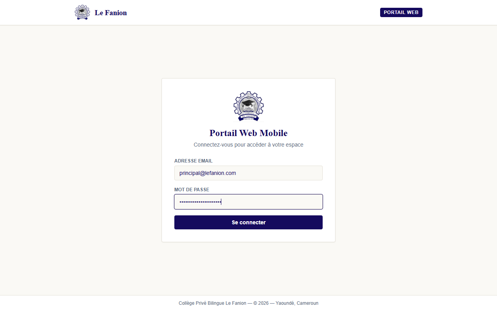
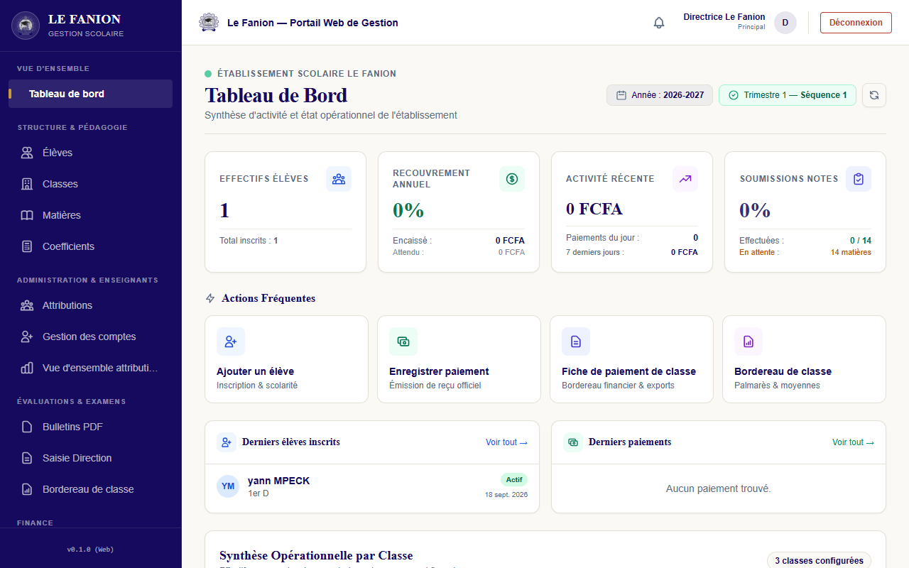
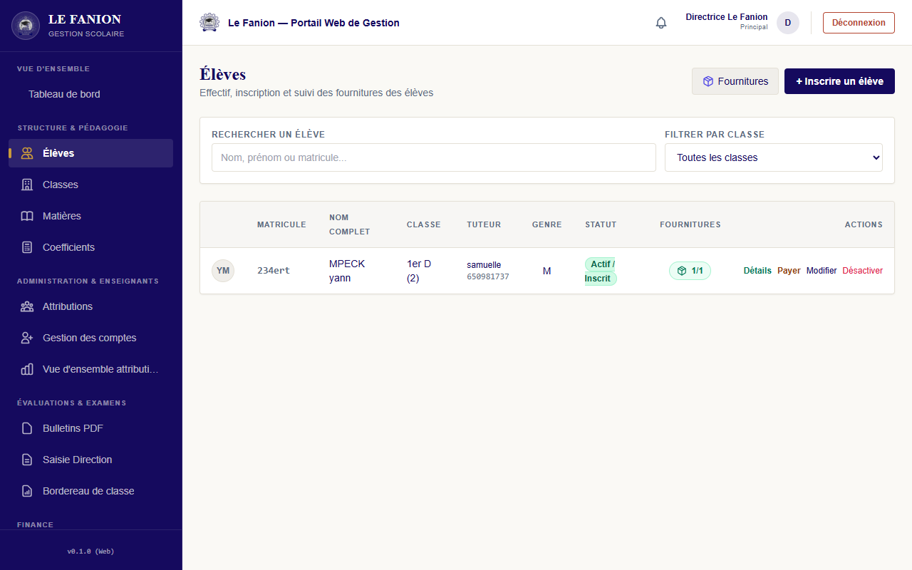
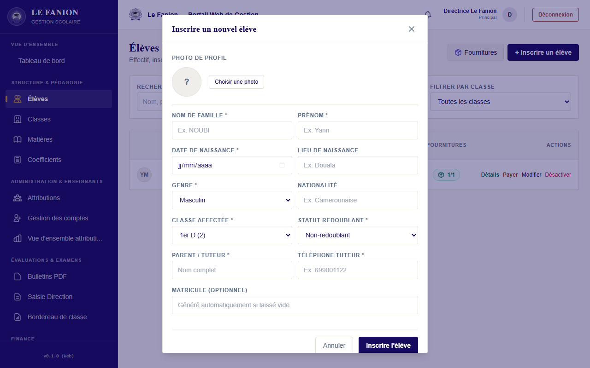
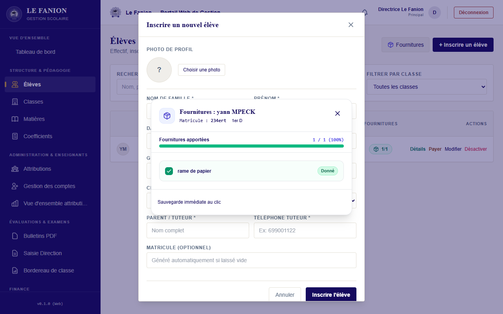
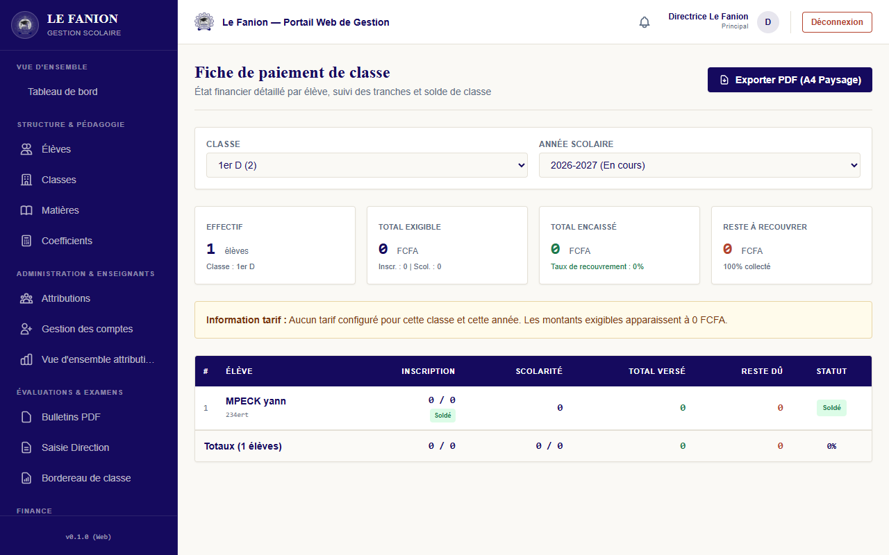
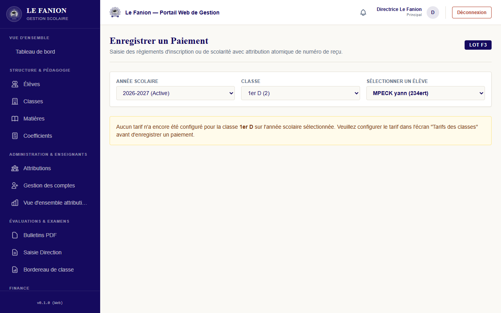
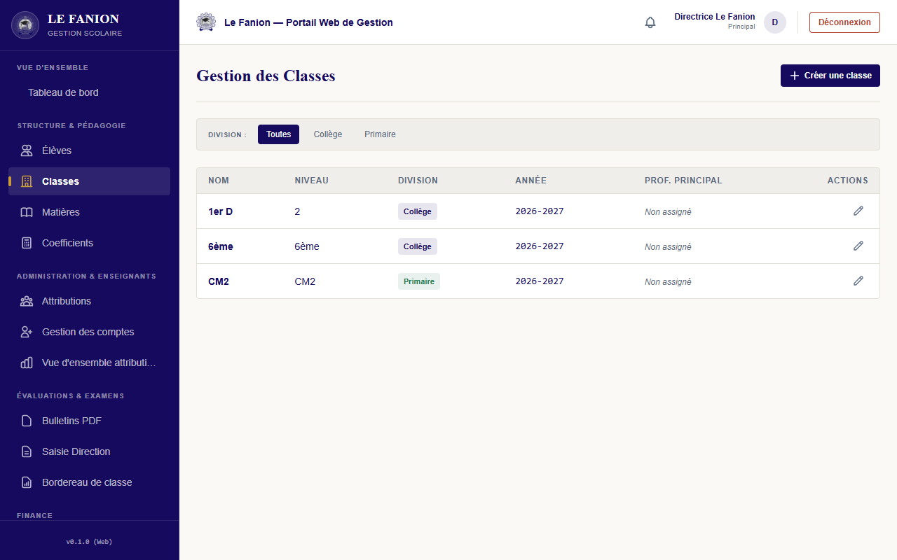
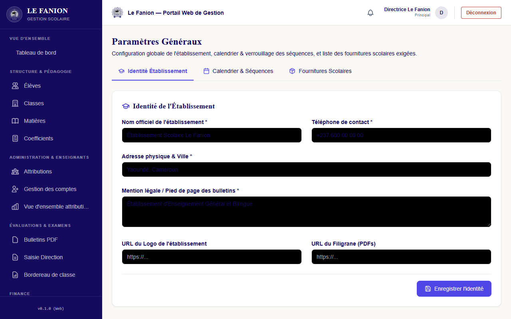

# Le Fanion — Manuel d'Utilisation Complet

**Plateforme de Gestion Scolaire**  
Version 2.0 — Édition Direction & Enseignants

---

*Ce manuel est destiné aux équipes de direction (Principal, Directeur des Études) et aux enseignants de l'établissement. Il couvre l'intégralité des fonctionnalités disponibles sur la plateforme "Le Fanion", de la connexion initiale jusqu'à la génération des bulletins de fin de séquence.*

---

## Table des matières

1. Présentation de la plateforme
2. Accès et Connexion
3. Le Tableau de Bord (Direction)
4. Gestion des Élèves
   - 4.1 Consulter la liste des élèves
   - 4.2 Inscrire un nouvel élève
   - 4.3 Modifier la fiche d'un élève
   - 4.4 Consulter le profil détaillé d'un élève
   - 4.5 Désactiver (archiver) un élève
   - 4.6 Gérer les fournitures scolaires
5. Finances et Comptabilité
   - 5.1 Vue d'ensemble financière
   - 5.2 Ajuster le montant de scolarité d'un élève
   - 5.3 Encaisser un paiement
   - 5.4 Générer un reçu de paiement
6. Gestion des Classes
   - 6.1 Consulter la liste des classes
   - 6.2 Créer une nouvelle classe
   - 6.3 Modifier une classe existante
7. Gestion des Matières et Attributions
8. Notes et Bulletins
   - 8.1 Saisie des notes (Enseignant)
   - 8.2 Consultation et verrouillage (Direction)
   - 8.3 Génération des bulletins PDF
9. Paramètres de l'Établissement
   - 9.1 Informations de l'école
   - 9.2 Gestion de l'Année scolaire et du Calendrier
   - 9.3 Gestion des Comptes Utilisateurs
   - 9.4 Configuration des Fournitures
10. Espace Enseignant
11. Dépannage et Questions Fréquentes

---

## 1. Présentation de la plateforme

**Le Fanion** est une solution de gestion scolaire tout-en-un conçue pour les établissements d'enseignement primaire et secondaire. Elle centralise dans une interface unique et sécurisée :

- **L'administration scolaire** : inscription des élèves, gestion des classes et des divisions.
- **La comptabilité** : suivi des paiements de scolarité, génération de reçus, état de recouvrement par classe.
- **Le suivi académique** : saisie et consultation des notes par séquence et trimestre, génération des bulletins au format PDF.
- **La gestion des ressources humaines** : comptes et accès des enseignants et de la direction.
- **La logistique** : suivi de la remise des fournitures scolaires.

La plateforme est accessible via un navigateur web (version web responsive) ou via l'application de bureau installée sur les ordinateurs de l'établissement.

> **Principe de sécurité fondamental** : tous les accès et permissions sont contrôlés par la base de données. Ce n'est pas l'interface qui détermine ce que vous pouvez faire, mais votre rôle. Il est donc inutile de tenter de manipuler l'URL pour accéder à des fonctionnalités non autorisées.

---

## 2. Accès et Connexion

### 2.1 Comment se connecter

Pour accéder à la plateforme, ouvrez l'application ou rendez-vous sur l'adresse URL fournie par votre administrateur système.

L'écran de connexion présente deux champs :

| Champ | Description |
|-------|-------------|
| **Adresse e-mail** | Votre adresse professionnelle enregistrée dans le système |
| **Mot de passe** | Votre mot de passe personnel (sensible à la casse) |

Cliquez sur le bouton **"Se connecter"** pour valider votre authentification.

### 2.2 Identifiants de l'environnement de démonstration / test

> ⚠️ **Attention — Identifiants de test uniquement.** Ne pas utiliser en production.

| Rôle | E-mail | Mot de passe |
|------|--------|--------------|
| **Principal (Direction)** | `principal@lefanion.com` | `PrincipalPassword2026!` |
| **Directeur des Études** | `directeuretudes@lefanion.com` | `EtudesPassword2026!` |

### 2.3 En cas de problème de connexion

- **Mot de passe oublié** : Contactez votre administrateur système pour une réinitialisation. Les réinitialisations de mot de passe se font directement dans le panneau d'administration Supabase.
- **Accès refusé** : Votre compte a peut-être été désactivé. Contactez la direction.
- **Page blanche ou erreur réseau** : Vérifiez votre connexion internet. Si le problème persiste, l'application est peut-être en maintenance.

---

## 3. Le Tableau de Bord (Direction)

Le tableau de bord est la première page affichée après votre connexion. Il offre une synthèse complète et en temps réel de l'état de l'établissement.

### 3.1 Bloc "Année scolaire & Séquence active"

En haut à gauche, vous trouvez les informations contextuelles de la période en cours :
- **Année scolaire active** : par exemple "2025-2026".
- **Séquence active** : La séquence d'évaluation en cours (ex: "Séquence 1 — Trimestre 1").

### 3.2 Bloc "Effectifs"

Ce bloc présente le nombre d'apprenants inscrits dans l'établissement, ventilé par statut :
- **Élèves actifs** : Élèves officiellement inscrits et dont la scolarité est en règle.
- **Élèves en attente** : Élèves dont le dossier est initié mais pas encore finalisé.

La décomposition par **division** (Collège, Lycée, etc.) permet de visualiser la répartition des effectifs.

### 3.3 Bloc "Finances"

C'est l'indicateur clé pour la direction financière. On y retrouve :
- **Total attendu** : Montant global de scolarité dû par l'ensemble des élèves pour l'année.
- **Total encaissé** : Somme de tous les paiements déjà reçus.
- **Reste à recouvrir** : Différence entre le montant attendu et le montant encaissé.
- **Taux de recouvrement** : Pourcentage d'encaissement global.
- **Paiements du jour** : Nombre et montant des paiements enregistrés aujourd'hui.
- **Paiements de la semaine** : Activité financière des 7 derniers jours.

### 3.4 Bloc "Académique"

Résumé de l'avancement de la saisie des notes :
- **Total de saisies attendues** : Nombre d'attributions (Enseignant × Classe × Matière) à renseigner pour la séquence active.
- **Notes soumises** : Nombre de soumissions de notes déjà effectuées.
- **Taux de soumission** : Pourcentage d'avancement de la saisie des notes.

### 3.5 Tableaux "Dernières activités"

En bas du tableau de bord, deux listes synthétiques :
- **5 derniers élèves inscrits** : Avec leur nom, classe et statut.
- **5 derniers paiements** : Avec le nom du parent, le montant et la date.

Ces listes permettent un suivi de l'activité récente sans avoir à naviguer dans chaque section.

---

## 4. Gestion des Élèves

L'onglet **Élèves**, accessible depuis le menu latéral gauche, centralise la gestion administrative de tous les apprenants.

### 4.1 Consulter la liste des élèves

La liste affiche les informations essentielles de chaque élève :

| Colonne | Description |
|---------|-------------|
| **Photo** | Avatar ou initiales si pas de photo |
| **Matricule** | Identifiant unique de l'élève dans l'établissement |
| **Nom complet** | Nom de famille en majuscules suivi du prénom |
| **Classe** | Classe actuelle de l'élève |
| **Tuteur** | Nom et téléphone du tuteur légal |
| **Genre** | M (Masculin) ou F (Féminin) |
| **Statut** | Badge de couleur : Vert = Actif, Orange = En attente, Gris = Inactif |
| **Fournitures** | Ratio d'articles remis (ex: 3/5) |
| **Actions** | Boutons Détails / Payer / Modifier / Désactiver |

#### Filtres et recherche

Deux filtres sont disponibles en haut de la liste :
- **Filtre par Classe** : Menu déroulant pour n'afficher que les élèves d'une classe précise.
- **Barre de recherche** : Recherche instantanée par nom, prénom ou matricule.

La sélection de filtre est **mémorisée** automatiquement entre les navigations.

### 4.2 Inscrire un nouvel élève

Pour inscrire un élève, cliquez sur le bouton **"+ Inscrire un élève"** en haut à droite de la liste.

La fenêtre de saisie s'ouvre avec les champs suivants :

**Informations personnelles de l'élève :**
- **Prénom** *(obligatoire)* : Prénom(s) de l'élève.
- **Nom de famille** *(obligatoire)* : Nom de naissance (affiché en majuscules).
- **Genre** *(obligatoire)* : Masculin ou Féminin.
- **Date de naissance** : Au format JJ/MM/AAAA.
- **Lieu de naissance** : Ville ou commune.
- **Photo** : Vous pouvez importer une photo au format JPG ou PNG (moins de 2 Mo).

**Informations scolaires :**
- **Classe** *(obligatoire)* : Sélectionnez la classe de l'élève dans la liste déroulante.
- **Statut** : Par défaut "En attente". Passez à "Actif" lorsque le dossier est validé.

**Informations du tuteur légal :**
- **Nom du tuteur** *(obligatoire)* : Nom complet du parent ou tuteur.
- **Téléphone du tuteur** *(obligatoire)* : Numéro de contact principal.

Après avoir rempli tous les champs requis, cliquez sur **"Enregistrer"**. L'élève apparaît immédiatement dans la liste. Pour annuler sans enregistrer, cliquez sur **"Annuler"** ou sur la croix en haut à droite de la fenêtre.

### 4.3 Modifier la fiche d'un élève

Cliquez sur le bouton **"Modifier"** à droite d'un élève dans la liste. La même fenêtre que pour l'inscription s'ouvre, avec les informations déjà remplies. Modifiez les champs souhaités puis cliquez sur **"Enregistrer"**.

### 4.4 Consulter le profil détaillé d'un élève

Cliquez sur le bouton **"Détails"** pour accéder à la fiche complète d'un élève. Cette page synthétise :
- Ses informations personnelles complètes.
- Son historique de paiements.
- Ses notes par séquence.
- Son état des fournitures.

### 4.5 Désactiver (archiver) un élève

Si un élève quitte l'établissement, cliquez sur **"Désactiver"**. Une confirmation vous sera demandée. L'élève passe au statut **"Inactif"** et n'est plus comptabilisé dans les effectifs actifs, mais ses données sont conservées.

> ⚠️ La désactivation est **réversible** via une modification de fiche (statut "Actif").

### 4.6 Gérer les fournitures scolaires

Le bouton **"Fournitures"** (icône de colis en haut de la liste des élèves) vous redirige vers la configuration de la liste des articles attendus pour chaque classe.

Pour pointer les fournitures reçues d'un élève, cliquez sur le badge coloré (ex: **2/5**) sur sa ligne.

La fenêtre affiche la liste des articles configurés pour la classe de l'élève. Pour chaque article :
- Cochez la case si l'article a été apporté par l'élève.
- Le décompte en haut se met à jour immédiatement.

**Code couleur du badge :**
- 🟢 **Vert** : Toutes les fournitures ont été remises.
- 🟡 **Orange** : Fournitures partiellement remises.
- ⚪ **Gris** : Aucune fourniture remise.

---

## 5. Finances et Comptabilité

L'onglet **Finances** centralise toute la gestion comptable de l'établissement.

### 5.1 Vue d'ensemble financière

La page Finances donne accès aux sous-sections suivantes :
- **Paiements** : Enregistrer et consulter les versements de scolarité.
- **Barème de frais** : Définir les montants de scolarité par classe.

### 5.2 Ajuster le montant de scolarité d'un élève

Pour modifier le montant attendu d'un élève spécifique (cas particulier, bourse, réduction familiale), accédez à la fiche de l'élève via la liste des élèves → bouton **"Détails"** → section financière.

Un bouton **"Ajuster la scolarité"** permet de définir un montant personnalisé qui remplacera le barème standard de la classe.

### 5.3 Encaisser un paiement

Pour enregistrer le paiement d'un parent, il y a deux chemins :

**Chemin 1 — Depuis la liste des Élèves :**
Cliquez sur le bouton **"Payer"** sur la ligne de l'élève concerné.

**Chemin 2 — Depuis Finances → Paiements :**
Cherchez l'élève dans la liste et cliquez sur "Ajouter un paiement".

La page de paiement affiche :

| Information | Description |
|-------------|-------------|
| **Nom de l'élève** | Pré-rempli automatiquement |
| **Classe** | Pré-remplie automatiquement |
| **Total attendu** | Montant total de scolarité de l'élève |
| **Total déjà payé** | Somme des versements précédents |
| **Reste à payer** | Calculé automatiquement |

**Saisie du paiement :**
1. **Montant versé** *(obligatoire)* : Le montant encaissé lors de cette transaction.
2. **Date de paiement** *(obligatoire)* : Pré-remplie à la date du jour, modifiable.
3. **Mode de règlement** : Espèces, chèque, virement, etc.

Cliquez sur **"Valider le paiement"** pour enregistrer. Un numéro de reçu est automatiquement généré.

### 5.4 Générer un reçu de paiement

Après validation d'un paiement (ou en consultant l'historique des paiements d'un élève), cliquez sur le bouton **"Imprimer le reçu"**. Le reçu au format PDF s'ouvre dans un nouvel onglet, prêt à être imprimé ou sauvegardé. Il contient :
- Les coordonnées de l'établissement.
- Le nom de l'élève et sa classe.
- Le montant versé et la date.
- Le numéro de reçu unique.

---

## 6. Gestion des Classes

L'onglet **Classes** permet de gérer la structure académique de l'établissement.

### 6.1 Consulter la liste des classes

La liste présente chaque classe avec :
- **Nom de la classe** (ex: 6ème A, Terminale C).
- **Division** (Collège, Lycée, etc.).
- **Nombre d'élèves** actuellement inscrits.
- **Nombre de matières** attribuées.
- Des boutons d'action : **Modifier**, **Voir les élèves**, **Supprimer**.

### 6.2 Créer une nouvelle classe

Cliquez sur le bouton **"+ Nouvelle classe"** en haut à droite.

Renseignez les informations suivantes :
- **Nom de la classe** *(obligatoire)* : Exemple "5ème B".
- **Niveau** *(obligatoire)* : Sélectionnez dans la liste déroulante (6ème, 5ème, 4ème, etc.).
- **Division** *(obligatoire)* : Collège, Lycée, Technique, etc.

Cliquez sur **"Enregistrer"** pour valider la création.

### 6.3 Modifier une classe existante

Cliquez sur le bouton **"Modifier"** à droite de la classe concernée. La même fenêtre s'ouvre avec les données actuelles pré-remplies. Faites vos modifications et cliquez sur **"Enregistrer"**.

> ⚠️ La suppression d'une classe n'est possible que si **aucun élève** n'y est inscrit. Transférez ou désactivez les élèves avant de supprimer.

---

## 7. Gestion des Matières et Attributions

L'onglet **Matières** vous permet de configurer le référentiel de disciplines enseignées dans l'établissement et d'attribuer chaque matière à un enseignant et une classe.

**Ajouter une matière :**
1. Cliquez sur **"+ Nouvelle matière"**.
2. Renseignez le nom (ex: "Mathématiques"), le coefficient et la division concernée.

**Attribuer une matière :**
Les attributions (quel professeur enseigne quelle matière dans quelle classe) se gèrent dans la section **"Attributions"** de chaque classe ou via le profil de chaque enseignant.

---

## 8. Notes et Bulletins

Le module académique gère le cycle complet : de la saisie des notes par les enseignants à l'édition des bulletins par la direction.

### 8.1 Saisie des notes (Enseignant)

Un enseignant connecté sur son compte n'a accès qu'à ses propres classes et matières. Dans l'onglet **"Mes Notes"** :

1. Sélectionnez la **classe** et la **séquence**.
2. La liste des élèves de la classe s'affiche.
3. Saisissez la note de chaque élève (sur 20).
4. Cliquez sur **"Soumettre les notes"** pour valider. Cette action est définitive et informe la direction que les notes sont prêtes.

### 8.2 Consultation et verrouillage (Direction)

Dans l'onglet **"Soumissions"**, la direction consulte le tableau des soumissions de notes pour la séquence active. Un code couleur indique l'état de chaque attribution (matière × classe) :
- 🔴 **Rouge** : Notes non encore soumises.
- 🟡 **Orange** : Soumises mais non verrouillées.
- 🟢 **Vert** : Soumises et verrouillées (bulletins imprimables).

Le **verrouillage** d'une séquence empêche toute modification ultérieure des notes par les enseignants et active la génération des bulletins.

### 8.3 Génération des bulletins PDF

L'onglet **"Bulletins"** permet d'imprimer les bulletins de fin de séquence.

1. Sélectionnez la **Classe** et la **Séquence** souhaitée.
2. Cliquez sur **"Générer les bulletins"**. Un PDF A4 est créé, contenant un bulletin par page pour chaque élève de la classe.
3. Téléchargez ou imprimez directement depuis le navigateur.

Chaque bulletin contient :
- Les coordonnées de l'établissement.
- Le nom, prénom, classe et matricule de l'élève.
- Le tableau des notes par matière (note, moyenne de la classe, rang).
- La note de conduite et les appréciations.
- La décision du conseil de classe.

---

## 9. Paramètres de l'Établissement

L'onglet **Paramètres** est accessible uniquement aux utilisateurs ayant le rôle **Principal**. Il centralise la configuration globale de l'établissement.

### 9.1 Informations de l'école

Cet onglet vous permet de renseigner ou de mettre à jour :
- **Nom de l'établissement** : Le nom officiel qui apparaîtra sur tous les documents (bulletins, reçus).
- **Adresse** : Adresse postale complète.
- **Téléphone** : Numéro de contact principal.
- **Région / Académie** : Pour les reportings officiels.

Cliquez sur **"Enregistrer"** pour valider les modifications.

### 9.2 Gestion de l'Année scolaire et du Calendrier

Dans l'onglet **"Année scolaire"**, vous gérez le calendrier académique :

**Créer une nouvelle année scolaire :**
1. Cliquez sur **"+ Nouvelle année scolaire"**.
2. Renseignez le libellé (ex: "2026-2027"), la date de début et de fin.
3. Cochez la case **"Année active"** pour en faire l'année courante.

> ⚠️ Une seule année scolaire peut être active à la fois. Activer une nouvelle année désactive automatiquement la précédente.

**Configurer les séquences et trimestres :**
Chaque année scolaire est découpée en **trimestres**, eux-mêmes divisés en **séquences** (généralement 2 séquences par trimestre). Vous pouvez :
- Ajouter, renommer ou supprimer des trimestres et des séquences.
- **Verrouiller** une séquence pour clôturer la saisie des notes.

### 9.3 Gestion des Comptes Utilisateurs

Cet onglet vous permet de gérer l'accès de tous les membres de l'équipe pédagogique et administrative.

**Liste des utilisateurs :**
Le tableau affiche pour chaque utilisateur :
- Son nom et adresse e-mail.
- Son rôle (Principal, Directeur des Études, Enseignant).
- Son statut (Actif / Désactivé).
- Un interrupteur pour activer ou désactiver son accès.

**Inviter un nouvel utilisateur (Enseignant) :**
1. Cliquez sur le bouton **"Inviter un utilisateur"**.
2. Renseignez l'adresse e-mail professionnelle de l'enseignant et son rôle.
3. Cliquez sur **"Envoyer l'invitation"**. L'enseignant reçoit un e-mail avec un lien pour créer son mot de passe et accéder à la plateforme.

**Désactiver un utilisateur :**
En cas de départ d'un collaborateur, basculez l'interrupteur sur sa ligne pour **bloquer immédiatement** son accès sans supprimer son historique d'activité.

### 9.4 Configuration des Fournitures Scolaires

L'onglet **"Fournitures"** (accessible aussi via le bouton "Fournitures" en haut de la liste des élèves) vous permet de configurer les listes de matériel demandées par classe :

1. Sélectionnez une **classe** dans le menu déroulant.
2. Ajoutez les articles requis (ex: "Cahier 200 pages", "Règle 30cm", "Dictionnaire").
3. Chaque article peut être rendu **obligatoire** ou facultatif.

Cette liste sera celle utilisée lors du pointage des fournitures sur la fiche de chaque élève.

---

## 10. Espace Enseignant

L'espace enseignant est une vue simplifiée, accessible uniquement aux comptes ayant le rôle **Enseignant**. Un enseignant ne peut voir et modifier que les données qui le concernent directement.

**Ce qu'un enseignant peut faire :**
- Consulter ses classes et ses matières attribuées.
- Saisir et soumettre les notes de ses élèves pour la séquence en cours.
- Consulter le bulletin prévisionnel de ses élèves.
- Mettre à jour son profil personnel (mot de passe).

**Ce qu'un enseignant ne peut pas faire :**
- Accéder aux informations financières.
- Voir les données des classes qui ne lui sont pas attribuées.
- Modifier les paramètres de l'établissement.
- Créer ou modifier des comptes utilisateurs.

---

## 11. Dépannage et Questions Fréquentes

**Q : Je ne vois pas certains boutons (ex: "Inscrire un élève") ?**
R : Votre compte ne dispose peut-être pas des droits suffisants. Seuls les rôles **Principal** et **Directeur des Études** ont accès aux fonctions d'écriture. Vérifiez votre rôle avec votre administrateur.

**Q : J'ai soumis de mauvaises notes. Puis-je les modifier ?**
R : Si la séquence n'est **pas encore verrouillée**, oui. Retournez dans l'onglet des notes, modifiez les valeurs et re-soumettez. Si la séquence est verrouillée, seul un **Principal** peut la déverrouiller temporairement depuis les Paramètres.

**Q : Le bulletin d'un élève n'affiche pas toutes les matières ?**
R : Cela signifie que certains enseignants n'ont pas encore soumis leurs notes. Consultez le tableau des soumissions pour identifier les attributions manquantes et relancez les enseignants concernés.

**Q : Comment changer mon mot de passe ?**
R : Allez dans votre profil (icône utilisateur en haut à droite) → **"Changer le mot de passe"**. Entrez votre ancien mot de passe, puis le nouveau (2 fois), et validez.

**Q : Un paiement a été enregistré par erreur. Comment l'annuler ?**
R : La suppression d'un paiement est une opération sensible réservée au **Principal**. Contactez l'administrateur système pour toute annulation. La piste d'audit est conservée en base de données pour des raisons comptables.

---

*Manuel généré automatiquement — Le Fanion v2.0*
*Pour toute demande de support, contactez l'équipe technique de l'établissement.*
