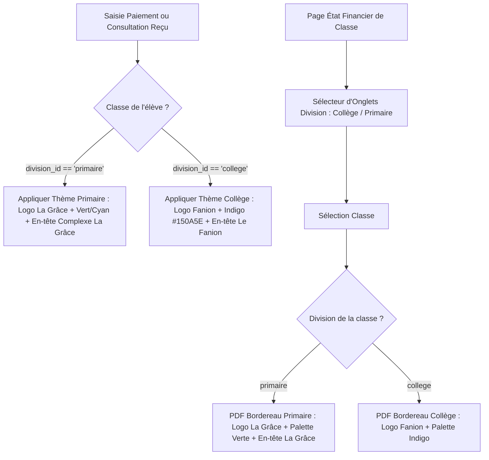

# Spécification Fonctionnelle & Technique : Reçu & Bordereau de Paiement pour le Primaire

**Date :** 2026-09-29  
**Auteur :** Antigravity AI  
**Statut :** En attente de validation utilisateur (Brainstorming validé)  
**Branche / Contexte :** `app_gestion` (Gestion Scolaire Le Fanion & Complexe Scolaire Bilingue La Grâce)

---

## 1. Contexte & Objectifs

L'établissement gère deux divisions distinctes :
1. **Le Collège** (« Collège Privé Laïque Le Fanion », identité sombre #150A5E, logo Fanion).
2. **Le Primaire** (« Complexe Scolaire Bilingue La Grâce », logo officiel colombe / lauriers, charte verte & cyan).

### Besoins exprimés :
1. **Reçu de paiement individuel pour le Primaire :**
   - Lorsqu'un élève appartient à une classe de la division `primaire`, le reçu généré (PDF) doit arborer automatiquement le logo officiel du primaire (`LOGO_PRIMAIRE_BASE64`), les couleurs de sa charte graphique (Vert forêt `#2D6A2D` et Cyan `#00A6B4`), et l'en-tête « COMPLEXE SCOLAIRE BILINGUE LA GRÂCE » avec sa devise « Discipline - Travail - Succès ».
   - Lorsqu'un élève appartient au `college`, le reçu conserve sa charte actuelle « COLLÈGE PRIVÉ LAÏQUE LE FANION » (#150A5E).

2. **Bordereau / État financier de classe pour le Primaire :**
   - Sur la page **État financier de classe** (`ClassFinancialReportPage.tsx`), permettre de filtrer aisément entre les classes du **Collège** et du **Primaire** via des onglets de division `[Collège | Primaire]`.
   - Lors de l'export / impression du bordereau PDF (`generateClassFinancialReportPdf`), si la classe appartient à la division `primaire` :
     - Utiliser le logo du Primaire.
     - Utiliser la charte de couleurs Primaire (Vert forêt `#2D6A2D` pour les titres, cadres et en-têtes, Cyan `#00A6B4` pour les sous-lignes/accents).
     - Remplacer l'en-tête par « COMPLEXE SCOLAIRE BILINGUE LA GRÂCE ».

---

## 2. Charte Graphique & Assets du Primaire

### 2.1 Logo
- **Source :** `reference_client/primaire/PHOTO-2026-09-21-12-24-05.jpg` (Colombe blanche sur losange cyan turquoise, entourée d'une couronne de lauriers verts et de l'inscription circulaire « COMPLEXE SCOLAIRE BILINGUE LA GRÂCE » et « DISCIPLINE - TRAVAIL - SUCCÈS »).
- **Embarquement :** Un asset TypeScript dédié `LOGO_PRIMAIRE_BASE64` dans `packages/shared/assets/logoPrimaireBase64.ts` au format Base64 (compatible PDF-lib Web, Electron et Node).

### 2.2 Palette de Couleurs Primaire
| Rôle | Couleur Hex | Valeur RGB (pdf-lib) |
|---|---|---|
| **Couleur principale (Primary / Ink)** | `#2D6A2D` (Vert forêt) | `rgb(0.176, 0.416, 0.176)` |
| **Couleur d'accent / secondaire** | `#00A6B4` (Cyan lagon) | `rgb(0.0, 0.651, 0.706)` |
| **Texte secondaire / Sous-titres** | `#4A5568` (Ardoise) | `rgb(0.29, 0.33, 0.41)` |
| **Fond d'en-tête de tableau / Cartouche** | `#EBF7F0` (Vert d'eau clair) | `rgb(0.92, 0.97, 0.94)` |
| **Bordures / Filets** | `#CBE8D6` | `rgb(0.796, 0.910, 0.839)` |

---

## 3. Architecture Technique & Modifications

### 3.1 `packages/shared/assets/logoPrimaireBase64.ts` (Nouveau fichier)
- Export de `LOGO_PRIMAIRE_BASE64` (image JPEG/PNG en Data URL Base64).

### 3.2 `packages/shared/api/receiptPdfService.ts`
- Récupérer `division_id` lors du fetch de la classe de l'élève : `.select("*, classes(name, level, division_id)")`.
- Conditionner les couleurs, l'en-tête textuel et le logo selon `isPrimary = student.classes?.division_id === "primaire"` :
  - **Logo :** `logoPrimaire` avec `pdfDoc.embedJpg(logoBuffer)` ou `logoFanion` avec `pdfDoc.embedPng(...)`.
  - **En-tête :** « COMPLEXE SCOLAIRE BILINGUE LA GRÂCE » vs « COLLÈGE PRIVÉ LAÏQUE LE FANION ».
  - **Couleurs :** Cadres, textes, titres et filigrane central adaptés dynamiquement.

### 3.3 `packages/shared/api/classFinancialReportPdfService.ts`
- Le rapport contient déjà `report.divisionId` (fourni par `getClassFinancialReport`).
- Conditionner l'en-tête, le logo, les cadres, et les arrière-plans des colonnes de tranches selon `isPrimary = report.divisionId === "primaire"`.

### 3.4 `packages/web/src/pages/finance/ClassFinancialReportPage.tsx`
- Ajouter le sélecteur de division `[Collège | Primaire]` dans la barre de filtres (identique à `BulletinsPdfPage.tsx`).
- Mémoriser la division persistée via `useSelectionPersistence("financialDivision", "college")`.
- Filtrer la liste des classes sélectionnables selon la division active.

---

## 4. Plan de Test et Validation

1. **Reçu d'un élève du Primaire (ex: SIL, CP, CE1...) :**
   - Générer ou afficher un reçu existant.
   - Vérifier la présence du logo "La Grâce", de l'en-tête "COMPLEXE SCOLAIRE BILINGUE LA GRÂCE", et des couleurs Vert / Cyan.
2. **Reçu d'un élève du Collège (ex: 6ème, 3ème...) :**
   - Vérifier que le reçu du collège reste intact (Logo Le Fanion, couleurs Indigo #150A5E).
3. **Bordereau / Fiche de paiement de classe :**
   - Basculer sur l'onglet "Primaire", sélectionner une classe du primaire.
   - Télécharger l'état financier PDF : vérifier le logo du primaire, les bordures et l'en-tête.
   - Basculer sur l'onglet "Collège" : vérifier la conformité du bordereau Collège.
